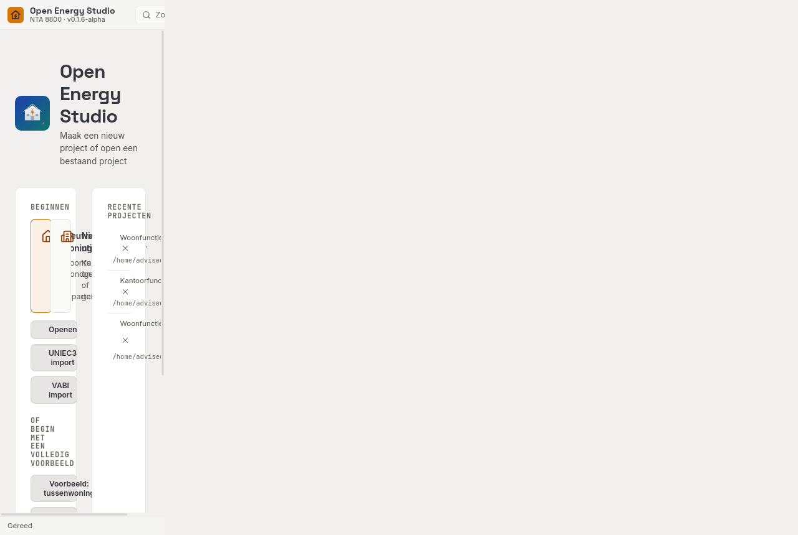
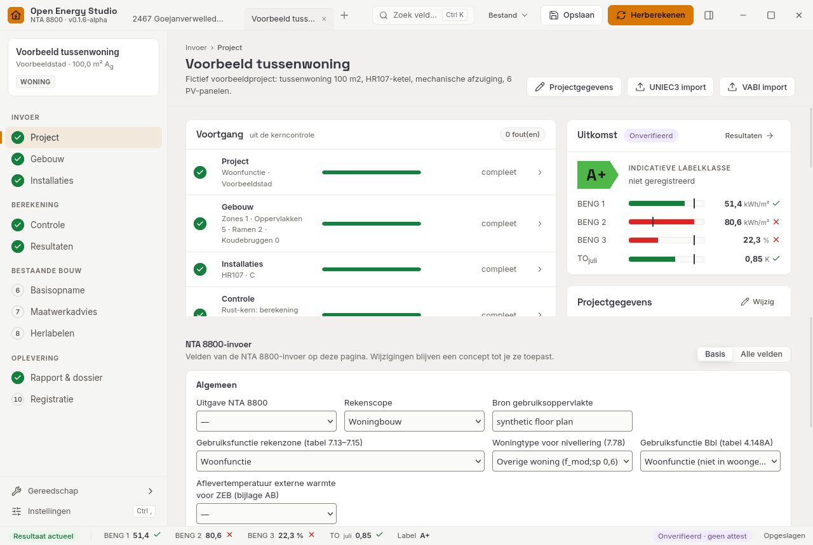
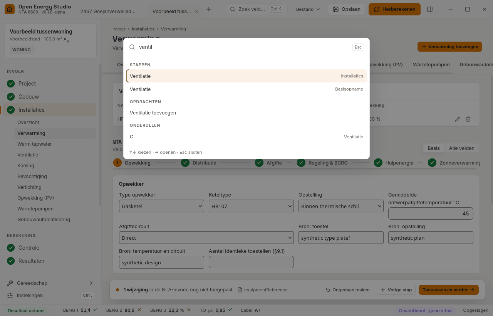
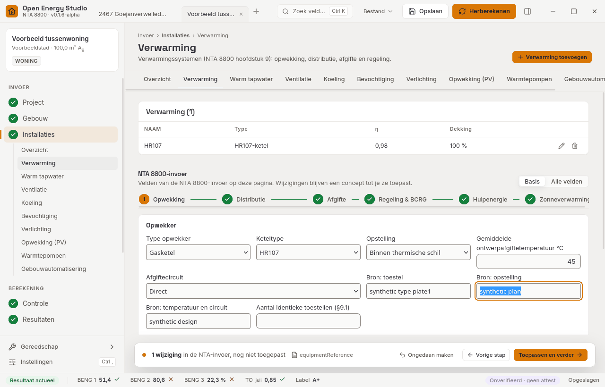
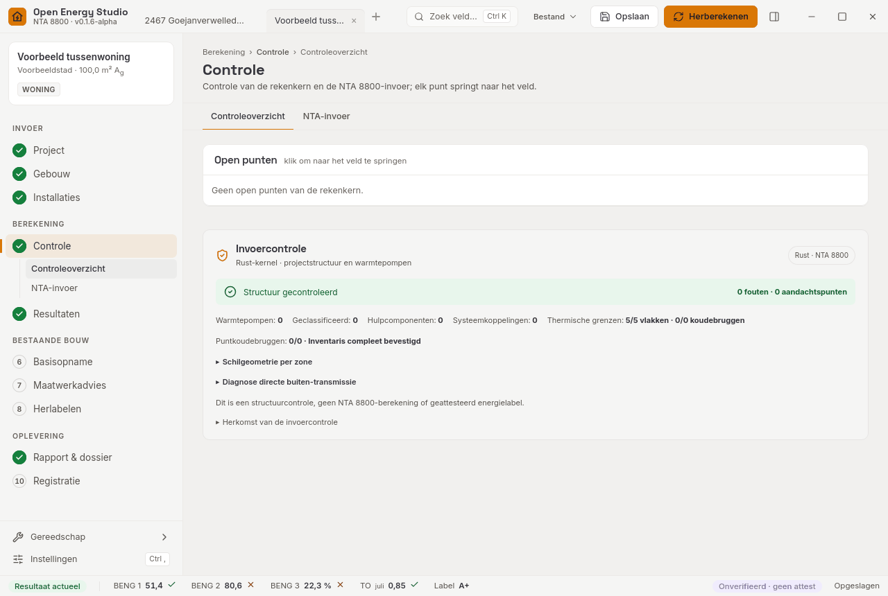
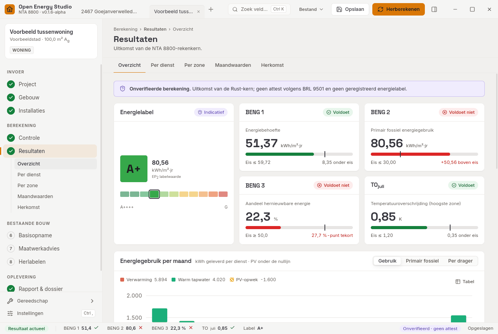
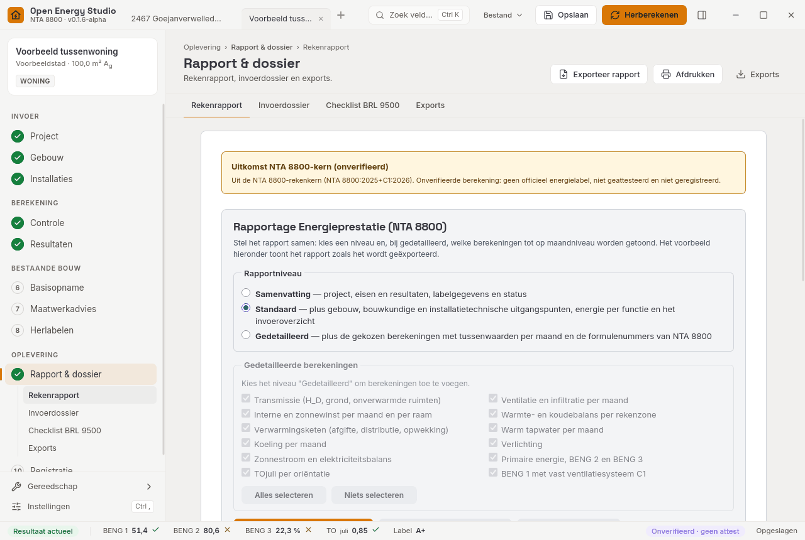
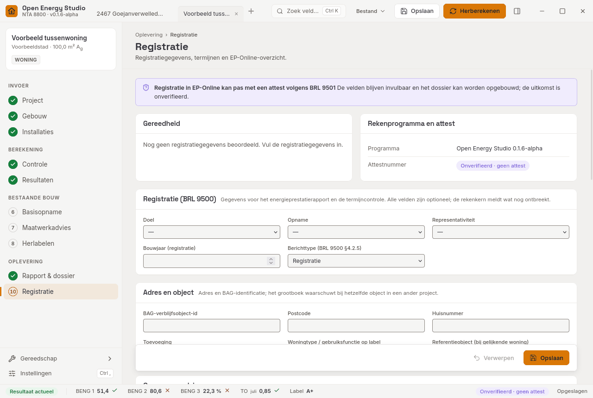

# 0. Werken met het programma

Dit hoofdstuk beschrijft de schermindeling en de navigatie van Open Energy Studio. Het geldt voor de desktopversie en de browserversie. De schermafdrukken zijn gemaakt met het voorbeeld *tussenwoning* in het lichte thema.

## Welkomstscherm

Bij het starten opent het programma het demoproject *2467 Goejanverwelledijk 85 Gouda* (fictief). Sluit je alle projecttabbladen, dan toont het programma het welkomstscherm.

- **Nieuwe woning** of **Nieuw utiliteitsgebouw** start een leeg project met de juiste gebruiksfunctie.
- **Openen** (Ctrl+O) opent een `.oes.json`. **UNIEC3 import** en **VABI import** lezen een uitwisselbestand in (zie [hoofdstuk 9](09-bestanden-en-uitwisseling.md)).
- **Recente projecten** (alleen desktop) toont de bestanden die je hebt geopend of opgeslagen, met gebruiksfunctie, datum en, als het project bij het opslaan was doorgerekend, de indicatieve labelklasse. Met × haal je een bestand uit de lijst; het bestand zelf blijft bestaan.
- De twee **voorbeelden** zijn fictieve oefenprojecten.

## Schermindeling

Het venster heeft vijf delen:

1. **Bovenbalk**: projecttabbladen, het zoekveld (Ctrl+K), het menu **Bestand**, **Opslaan** (Ctrl+S), **Herberekenen** (Ctrl+Enter) en de knop voor het contextpaneel (Ctrl+.).
2. **Werkstappen** links, genummerd en in vier groepen:
   - *Invoer*: 1 Project, 2 Gebouw, 3 Installaties;
   - *Berekening*: 4 Controle, 5 Resultaten;
   - *Bestaande bouw*: 6 Basisopname, 7 Maatwerkadvies, 8 Herlabelen;
   - *Oplevering*: 9 Rapport & dossier, 10 Registratie.

   Elke stap toont zijn status: gereed (vinkje), het aantal fouten of waarschuwingen, of nog niet begonnen. Onder de actieve stap staan de subpagina's. Met Alt+↑ en Alt+↓ ga je naar de vorige of volgende stap.
3. **Werkgebied** in het midden: de pagina van de gekozen stap, met bovenaan het pad (bijv. *Invoer › Installaties › Verwarming*), de titel, de subtabbladen en de knoppen van die pagina.
4. **Contextpaneel** rechts, met drie tabbladen:
   - *Eigenschappen*: de gegevens van het geselecteerde element (zone, constructie, vlak, raam, systeem). Je kunt ze hier direct wijzigen. Selecteer je een element, dan opent dit tabblad, ook als *Voorbeeld* open stond. Bij een vlak, raam, koudebrug of zone staat hier ook het blok **Bron & bewijs** met de bestanden die bij dat element horen;
   - *Voorbeeld*: label, BENG 1–3, TOjuli, maandbehoefte en kerngetallen van de laatste doorrekening;
   - *Controle*: de open punten van de rekenkern voor deze stap, elk met **Ga naar**.
5. **Statusbalk** onderaan: de status van de rekenkern (actueel, verouderd, bezig), kern- en normversie, BENG 1–3, TOjuli en het label. Klik op een waarde om Resultaten te openen.

Onder de werkstappen staan **Gereedschap** en **Instellingen** (Ctrl+,).

## Zoeken en opdrachten (Ctrl+K)

Ctrl+K opent het opdrachtenpalet. Je zoekt op elk woord, hoofdletterongevoelig. Het palet vindt:
- werkstappen en subpagina's;
- opdrachten, zoals Opslaan, Herberekenen, exports en imports;
- invoervelden van het NTA-formulier;
- elementen van het project (zones, constructies, systemen).

Met ↑ en ↓ kies je een regel, met Enter voer je hem uit en met Esc sluit je het palet.

## Gereedschap

Het menu **Gereedschap** bevat drie losse rekenhulpen die niets aan het project veranderen:
- U-waardecalculator;
- koudebrugcalculator;
- warmtepompdimensionering.

Ze openen als pagina in het werkgebied.

## NTA-invoer in de stappen

De invoer van het NTA 8800-formulier staat verdeeld over de stappen waar hij inhoudelijk hoort. Voorbeelden: gebruiksfuncties en setpoints onder *Gebouw › Rekenzones*, opwekker en afgifte onder *Installaties › Verwarming*. De volledige toewijzing staat in [hoofdstuk 3](03-projectberekening.md).

- **Basis / Alle velden.** Rechtsboven kies je of alleen de gangbare velden zichtbaar zijn of alle velden. In de stand Basis staan de overige velden onder **Geavanceerd**; dat blok staat open zodra een van die velden is ingevuld, een melding heeft of het doel is van Ga naar. De keuze wordt onthouden.
- **Verwarming** is opgedeeld in Opwekking, Distributie, Afgifte, Regeling & BCRG, Hulpenergie en Zonneverwarming. Het overzicht van Installaties toont deze keten per verwarmingssysteem. Een groene stip betekent dat dat deel is ingevuld; klik op een deel om het te openen.
- **Eén concept.** Wijzigingen in de NTA-invoer gaan eerst in een concept dat over alle stappen heen blijft bestaan. De **toepasbalk** onderaan toont hoeveel wijzigingen nog niet zijn toegepast, met **Ongedaan maken**, **Vorige stap**, **Toepassen** en **Toepassen en verder**. Pas na Toepassen rekent de kern met de nieuwe invoer.
- **Project zonder NTA-invoer.** Een nieuw project heeft nog geen NTA-invoer. Op de stap Project staat dan "Dit project heeft nog geen NTA-invoer" met de knop **NTA-invoer starten**; die maakt een concept in de uitgave die onder *Instellingen › Berekening* is gekozen (standaard NTA 8800:2025+C1:2026).
- **Sluiten met een open concept.** Sluit je een projecttabblad terwijl het concept niet-toegepaste wijzigingen heeft, dan vraagt het programma eerst of je wilt sluiten zonder toe te passen. Daarna volgt, zoals altijd, de vraag om niet-opgeslagen wijzigingen op te slaan.
- **Bron & bewijs** onder een sectie toont de bronvelden en het bewijs bij die sectie. Per bronveld kies je een bewijsstuk uit het register of voeg je een bestand toe. Het bronveld krijgt dan `evidence:<id>` achter de tekst die er al stond, bijvoorbeeld `tekening A-101; evidence:ev-2`; een leeg bronveld krijgt alleen `evidence:<id>` (zie [hoofdstuk 7](07-herlabelen-registratie-dossier.md)).

## Controle en Ga naar

Stap 4 **Controle** verzamelt alle meldingen van de rekenkern: fouten, waarschuwingen en ontbrekende invoer, gegroepeerd per stap. Elke melding heeft **Ga naar**. Die opent de juiste stap, subpagina en (bij verwarming) het juiste deel van de keten, en zet de focus op het veld. Een veld met een melding krijgt een rode (fout) of gele (waarschuwing) rand.

Dezelfde meldingen voor de huidige stap staan in het contextpaneel onder *Controle*. Ga naar werkt ook vanuit Resultaten, Registratie, de basisopname en herlabelen.

## Uitgave van NTA 8800

Op de stap **Project** kies je de uitgave van NTA 8800 waarmee het project rekent: NTA 8800:2025+C1:2026 (de aangewezen uitgave en de standaard), 2024, 2023, 2022 of 2020+A1. Een project zonder gekozen uitgave rekent in de aangewezen uitgave; de keuzelijst toont die dan ook. Een oudere uitgave is alleen bedoeld voor vergelijking: het formulier, de projectstatus, Resultaten, de statusbalk en het rapport melden dan "Oudere uitgave — niet voor registratie". Onder *Instellingen › Berekening* kies je de uitgave voor nieuwe berekeningen; bestaande projecten houden hun uitgave. Zie [Normversies](10-normversies.md) en [hoofdstuk 8](08-versies-en-verwijzingen.md).

## Resultaten

Stap 5 **Resultaten** toont het dashboard: labelkaart met klasseschaal, BENG 1–3 en TOjuli tegen de eis, de energiegrafiek, de netto behoefte en de kerngetallen. De subpagina's zijn Per dienst, Per zone, Maandwaarden en Herkomst. Zie [hoofdstuk 4](04-uitvoer.md).

## Rapport & dossier en Registratie

Stap 9 **Rapport & dossier** heeft vier subpagina's:
- *Rekenrapport*: de rapportopbouw (niveau, taal, hoofdstukken), met voorbeeld, export en afdrukken;
- *Invoerdossier*;
- *Checklist BRL 9500*: de dossiercheck met het bewijsregister en het EP-Online-overzicht;
- *Exports*: BENG-rapport, NTA-rekenrapport, invoerdossier, projectdossier (ZIP), UNIEC3, VABI en IFC.

Stap 10 **Registratie** is een eigen pagina. Bovenaan staat of het project gereed is voor registratie en waarom niet. Daaronder staan het rekenprogramma met de attest-status, de open punten met Ga naar en het formulier met de registratiegegevens. Zie [hoofdstuk 7](07-herlabelen-registratie-dossier.md).

## Thema's, taal en toegankelijkheid

- Onder *Instellingen › Algemeen* kies je het thema **Donker**, **Licht** of **Hoog contrast**, en de taal. Nederlands en Engels zijn volledig vertaald; andere talen worden pas geladen als je ze kiest.
- Alle tekst haalt in elk thema een contrast van minstens 4,5:1, invoerranden en statusmarkeringen minstens 3:1.
- Het programma is volledig met het toetsenbord te bedienen. De focus is altijd zichtbaar als amberkleurige rand. **Naar inhoud** (eerste Tab) springt over de navigatie heen.
- Meldingen (de status van de rekenkern en de pop-upberichten rechtsonder) worden voorgelezen door schermlezers. Bij de systeeminstelling "minder beweging" staan animaties uit.

## Sneltoetsen

| Toets | Actie |
|---|---|
| Ctrl+K | Opdrachtenpalet |
| Ctrl+N / Ctrl+O | Nieuw project / openen |
| Ctrl+S / Ctrl+Shift+S | Opslaan / opslaan als |
| Ctrl+Enter | Herberekenen |
| Ctrl+. | Contextpaneel aan/uit |
| Ctrl+, | Instellingen |
| Alt+↑ / Alt+↓ | Vorige / volgende werkstap |
| Esc | Palet, menu of dialoog sluiten |
